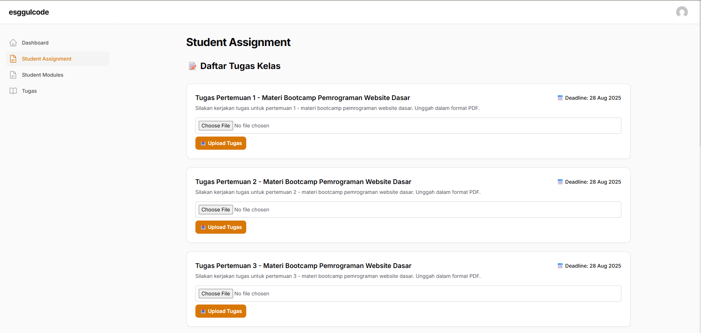
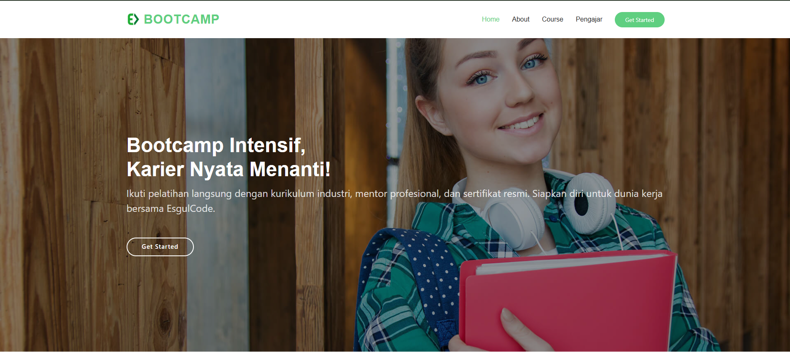

# ESGULCODE 2025 

<div align="center">

**Learning Management System (LMS) & Human Resource Management (HRM) Berbasis Web**

[](https://laravel.com)
[](https://filamentphp.com)
[](https://php.net)
[](https://docker.com)

</div>

---

## 📌 Deskripsi Proyek

Proyek **ESGULCODE 2025** merupakan implementasi **Sistem Informasi Terintegrasi** untuk mendukung **pembelajaran digital** (LMS) dan **manajemen sumber daya manusia** (HRM) di **EsgulCode Company**, sebuah perusahaan yang bergerak di bidang **EdTech** dan **HR Tech**.

Sistem ini dirancang untuk mendigitalisasi proses pendidikan dan manajemen SDM di Indonesia agar lebih **efisien, transparan, dan real-time**.

---

## 🚀 Fitur Utama

### 1. Learning Management System (LMS)

| Modul | Deskripsi |
|-------|-----------|
| 📹 Modul Video | Manajemen materi berupa video (link YouTube/Drive) |
| 📄 Materi Dokumen | Upload dan pengelolaan dokumen PDF |
| 📝 Tugas & Submissions | Sistem pengumpulan tugas dengan tracking |
| 🏆 Sertifikat Digital | Auto-generate sertifikat dengan QR code verifikasi |
| 🎓 Event Course | Bootcamp dan course hybrid (online/offline) |
| 💳 Pembayaran Terintegrasi | Midtrans payment gateway |

### 2. Human Resource Management (HRM)

| Modul | Deskripsi |
|-------|-----------|
| 👥 Data Pegawai | Multi-cabang, multi-departemen, multi-divisi |
| 🕐 Absensi Digital | Clock-in & Clock-out dengan tracking |
| 🏖️ Manajemen Cuti | Pengajuan & persetujuan cuti online |
| 💰 Payroll System | Gaji pokok, tunjangan, potongan, bonus |
| 📄 Slip Gaji Digital | Auto-generate dan distribusi slip gaji |
| 🎓 Event Training | Pelatihan internal karyawan |

### 3. Sistem Pendukung

| Sistem | Teknologi |
|--------|-----------|
| 🔐 Role-Based Access Control | Filament Shield (RBAC) |
| 📱 Notifikasi WhatsApp | Twilio API |
| 💳 Payment Gateway | Midtrans (Bank Transfer, QRIS, E-Wallet, Kartu Kredit) |
| 📧 Email Notification | SMTP |
| 📊 Activity Logging | Filament Logger |
| 🎨 Theme Management | Filament Themes + Light Switch |

---

## 🛠️ Teknologi yang Digunakan

### Backend
```
├── Laravel 12.x (PHP 8.2+)
├── Livewire 3.x
├── Filament v3.x
├── Spatie Permission (RBAC)
└── Filament Logger (Activity Log)
```

### Frontend
```
├── TailwindCSS
├── Alpine.js
└── Livewire Components
```

### Database
```
├── MariaDB 10.11
├── 24+ Migrations
├── 17+ Models
├── 15+ Seeders
└── 8+ Filament Resources
```

### Infrastructure
```
├── Docker & Docker Compose
├── Nginx (SSL Enabled)
├── PHP-FPM
└── MariaDB
```

---

## 📂 Struktur Database

### Core Models

| Model | Deskripsi | Relations |
|-------|-----------|-----------|
| `User` | Autentikasi & Autorisasi | Student, Employee, Roles |
| `Student` | Data Siswa | User, EventCourses, Submissions |
| `Employee` | Data Karyawan | User, Branch, Division, Position, Attendance |
| `Company` | Data Perusahaan | Employees |
| `Branch` | Data Cabangg | Employees |
| `Department` | Data Departemen | Employees |
| `Division` | Data Divisi | Employees |
| `Position` | Data Jabatan | Employees |
| `Attendance` | Data Absensi | Employee |
| `Leave` | Data Cuti | Employee |
| `SalaryPeriod` | Periode Gaji | PayrollDetails |
| `PayrollCategory` | Kategori Gaji | PayrollDetails |
| `PayrollDetail` | Detail Gaji | Employee, SalaryPeriod |
| `EventCourse` | Kursus/Event | Students, Instructor (Employee) |
| `Module` | Modul Pembelajaran | EventCourse, CreatedBy (Employee) |
| `Assignment` | Tugas | EventCourse, Submissions |
| `AssignmentsSubmission` | Pengumpulan Tugas | Assignment, Student |
| `PendingTransaction` | Transaksi Pending | - |

---

## 📁 Struktur File Proyek

```
esggulcode/
├── .gitignore
├── docker-compose.yml          # Docker orchestration
├── README.md
├── db/                         # Database configuration
│   ├── conf.d/
│   │   └── my.cnf
│   └── data/
├── docs/                       # Documentation & screenshots
│   └── images/
│       ├── dashboardadmin.png
│       ├── dashboardguru.png
│       ├── dashboardstudent.png
│       └── tampilanpengguna.png
├── nginx/                      # Web server configuration
│   ├── default.conf
│   ├── Dockerfile
│   └── ssl/
│       ├── esggulcode.test.crt
│       └── esggulcode.test.key
├── php/                        # PHP container configuration
│   ├── Dockerfile
│   ├── docker-entrypoint.sh
│   ├── local.ini
│   └── www.conf
└── src/                        # Laravel Application
    ├── app/
    │   ├── Console/
    │   ├── Filament/
    │   │   ├── Admin/
    │   │   ├── Pages/
    │   │   └── Resources/
    │   │       ├── AssignmentsResource.php
    │   │       ├── AssignmentsSubmissionsResource.php
    │   │       ├── AttendanceResource.php
    │   │       ├── LeaveResource.php
    │   │       ├── ModuleResource.php
    │   │       ├── PayrollDetailResource.php
    │   │       └── StudentResource.php
    │   ├── Http/
    │   │   ├── Controllers/
    │   │   │   ├── CertificateController.php
    │   │   │   ├── CourseController.php
    │   │   │   ├── MidtransCallbackController.php
    │   │   │   └── TrainerController.php
    │   │   └── Middleware/
    │   ├── Livewire/
    │   │   ├── About.php
    │   │   ├── Course.php
    │   │   ├── HomePage.php
    │   │   ├── Pengajar.php
    │   │   ├── StudentRegistration.php
    │   │   ├── TrainersIndex.php
    │   │   └── Components/
    │   ├── Models/
    │   │   ├── Assignments.php
    │   │   ├── AssignmentsSubmissions.php
    │   │   ├── Attendance.php
    │   │   ├── Branch.php
    │   │   ├── Company.php
    │   │   ├── Department.php
    │   │   ├── Division.php
    │   │   ├── Employee.php
    │   │   ├── EventCourse.php
    │   │   ├── Leave.php
    │   │   ├── Module.php
    │   │   ├── PayrollCategory.php
    │   │   ├── PayrollDetail.php
    │   │   ├── PendingTransaction.php
    │   │   ├── Position.php
    │   │   ├── SalaryPeriod.php
    │   │   ├── Student.php
    │   │   └── User.php
    │   ├── Policies/            # 17 Policy classes
    │   ├── Providers/           # App & Filament providers
    │   └── ...
    ├── bootstrap/
    ├── config/
    │   ├── app.php
    │   ├── auth.php
    │   ├── filament.php
    │   ├── filament-logger.php
    │   ├── filament-shield.php
    │   ├── midtrans.php
    │   ├── permission.php
    │   └── ...
    ├── database/
    │   ├── migrations/          # 24 migration files
    │   └── seeders/             # 15 seeder files
    ├── public/
    │   ├── css/
    │   ├── js/
    │   ├── images/
    │   └── build/
    ├── resources/
    │   ├── css/
    │   ├── js/
    │   └── views/
    ├── routes/
    │   ├── api.php
    │   ├── console.php
    │   └── web.php
    ├── storage/
    ├── tests/
    ├── artisan
    ├── composer.json
    ├── composer.lock
    ├── package.json
    ├── vite.config.js
    └── tailwind.config.js
```

---

## 🔑 Role-Based Access Control

| Role | Description | Panel Access |
|------|-------------|--------------|
| `super_admin` | Full system access | Admin Panel |
| `admin` | Administrative access | Admin Panel |
| `hrd` | HR Management | Admin Panel |
| `guru` / `instructor` | Teacher/Trainer | Admin Panel + Public |
| `siswa` / `student` | Student | Public Portal |
| `user` / `karyawan` | Regular Employee | Public Portal |

### Filament Shield Configuration
- Auto-generated policies for all resources
- Granular permissions (view, view_any, create, update, delete, delete_any)
- Custom permission support
- Role management UI

---

## 🌐 Routes & Endpoints

### Public Routes
| Method | Endpoint | Description |
|--------|----------|-------------|
| GET | `/` | Home Page |
| GET | `/about` | About Page |
| GET | `/course` | Course Listing |
| GET | `/pengajar` | Instructors/Trainers |
| GET | `/courses` | Course API |
| GET | `/register/{eventCourse}` | Student Registration |
| GET | `/trainers` | Trainers Listing |

### Payment Routes
| Method | Endpoint | Description |
|--------|----------|-------------|
| GET | `/payment/finish` | Payment Success Page |
| POST | `/midtrans/manual-callback` | Midtrans Webhook |

### Protected Routes (Auth Required)
| Method | Endpoint | Description |
|--------|----------|-------------|
| GET | `/student/certificate` | Download Certificate |

### Utility Routes
| Method | Endpoint | Description |
|--------|----------|-------------|
| GET | `/test-wa` | Twilio WhatsApp Test |

---

## ⚙️ Instalasi & Konfigurasi

### Prerequisites
- Docker & Docker Compose
- Git
- 4GB+ RAM
- 10GB+ Disk Space

### Installation Steps

```bash
# 1. Clone Repository
git clone https://github.com/Thifaaldz/esggulcode-2025.git
cd esggulcode-2025

# 2. Start Docker Containers
docker-compose up -d --build

# 3. Install Dependencies
docker-compose exec php composer install
docker-compose exec php npm install

# 4. Setup Environment
cp src/.env.example src/.env
docker-compose exec php php artisan key:generate

# 5. Database Migration & Seeding
docker-compose exec php php artisan migrate --seed

# 6. Build Assets
docker-compose exec php npm run build

# 7. Access Application
# HTTPS: https://esggulcode.test
# HTTP:  http://esggulcode.test
```

### Docker Services

| Service | Container | Ports | Description |
|---------|-----------|-------|-------------|
| PHP | esggulcode_php | - | PHP-FPM 8.2 |
| Nginx | esggulcode_nginx | 80, 443 | Web Server + SSL |
| MariaDB | esggulcode_db | 3306, 13306 | Database |

### Default Credentials

| Role | Email | Password |
|------|-------|----------|
| Super Admin | admin@esggulcode.test | password |
| HRD | hrd@esggulcode.test | password |
| Guru | guru@esggulcode.test | password |
| Siswa | siswa@esggulcode.test | password |

---

## 📸 Tampilan Sistem

### 🔑 Dashboard Admin


### 👨‍🏫 Dashboard Guru


### 🎓 Dashboard Siswa


### 🌐 Tampilan Pengguna


---

## 🔧 Konfigurasi Third-Party

### Midtrans (Payment Gateway)
```env
MIDTRANS_SERVER_KEY=your_server_key
MIDTRANS_CLIENT_KEY=your_client_key
MIDTRANS_IS_PRODUCTION=false
```

### Twilio (WhatsApp)
```env
TWILIO_SID=your_sid
TWILIO_TOKEN=your_token
TWILIO_WHATSAPP_FROM=whatsapp:+14155238886
```

### SMTP (Email)
```env
MAIL_MAILER=smtp
MAIL_HOST=smtp.mailtrap.io
MAIL_PORT=587
MAIL_USERNAME=your_username
MAIL_PASSWORD=your_password
```

---

## 🎯 Kesimpulan & Keunggulan Sistem

**ESGULCODE 2025** merupakan solusi komprehensif yang menggabungkan kebutuhan edukasi dan manajemen sumber daya manusia dalam satu platform terintegrasi.

### ✅ Keunggulan Utama

| Keunggulan | Deskripsi |
|------------|-----------|
| **Terintegrasi** | Satu platform untuk LMS dan HRM, menghindari data terpisah |
| **Skalabilitas** | Arsitektur modular memudahkan pengembangan fitur baru |
| **User-Friendly** | Interface intuitif dengan TailwindCSS + Livewire |
| **Real-time** | Notifikasi WhatsApp dan update data langsung |
| **Secure** | RBAC ketat dengan Filament Shield |
| **Mobile-Ready** | Responsive design untuk akses dari perangkat manapun |
| **Production-Ready** | Docker containerization dengan SSL, monitoring |

### 🚀 Benefits untuk Stakeholder

- **Bagi Perusahaan**: Efisiensi operasional HR hingga 60%, transparansi data karyawan
- **Bagi Guru/Pengajar**: Manajemen materi terpusat, easy monitoring progress siswa
- **Bagi Siswa**: Fleksibilitas belajar online/offline, sertifikat terverifikasi
- **Bagi HRD**: Otomatisasi payroll, cuti, dan absensi tanpa kesalahan manual

### 📈 Rencana Pengembangan

- [ ] Integrasi AI untuk rekomendasi course
- [ ] Mobile App (iOS/Android)
- [ ] Advanced Analytics & Dashboard
- [ ] Multi-tenant support untuk enterprise
- [ ] Zoom/Google Meet integration untuk kelas online
- [ ] Gamification system
- [ ] Multi-language support (EN, ID)

---

## 📁 Key Files Reference

### Configuration Files
- `src/composer.json` - PHP dependencies & scripts
- `src/config/filament-shield.php` - RBAC configuration
- `src/config/filament.php` - Filament settings
- `docker-compose.yml` - Docker orchestration
- `nginx/default.conf` - Nginx configuration

### Database
- `src/database/migrations/` - All database migrations
- `src/database/seeders/` - Database seeders
- `src/app/Models/` - Eloquent models

### Filament Resources
- `src/app/Filament/Resources/` - Admin panel resources

### Livewire Components
- `src/app/Livewire/` - Public facing components

---

## 📧 Kontak & Dukungan

**Thifa Aldz** - Main Developer

📂 Repository: [github.com/Thifaaldz/esggulcode-2025](https://github.com/Thifaaldz/esggulcode-2025)

🐛 Issues: [GitHub Issues](https://github.com/Thifaaldz/esggulcode-2025/issues)

---

<div align="center">

**Dibuat dengan ❤️ oleh EsgulCode Team**

*© 2025 EsgulCode Company - All Rights Reserved*

**Tech Stack: Laravel 12 • Filament v3 • Docker • MariaDB**

</div>

